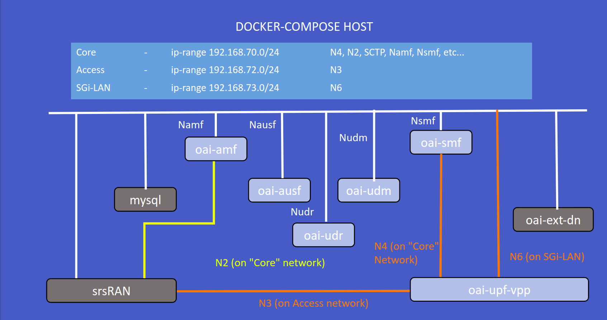

<table style="border-collapse: collapse; border: none;">
  <tr style="border-collapse: collapse; border: none;">
    <td style="border-collapse: collapse; border: none;">
      <a href="http://www.openairinterface.org/">
         
         </img>
      </a>
    </td>
    <td style="border-collapse: collapse; border: none; vertical-align: center;">
      <b><font size = "5">OpenAirInterface 5G Core Network Deployment and Testing with srsRAN</font></b>
    </td>
  </tr>
</table>




**Reading time: ~ 30mins**

**Tutorial replication time: ~ 1h30mins**

Note: In case readers are interested in deploying debuggers/developers core network environment with more logs please follow [this tutorial](./DEBUG_5G_CORE.md)

**TABLE OF CONTENTS**

1.  Pre-requisites
2.  Building Container Images
3.  Configuring Host Machines
4.  Configuring OAI 5G Core Network Functions
5.  Deploying OAI 5G Core Network
6.  [Getting a `srsRAN` docker image](#6-getting-a-srsRAN-docker-image)
7.  [Executing `my5G-RANTester` Scenario](#7-executing-the-srsRAN-scenario)
8.  [Analysing Scenario Results](#8-analysing-the-scenario-results)
9.  [Trying some advanced stuff](#9-trying-some-advanced-stuff)

* In this demo the image tags and commits which were used are listed below, follow the [Building images](./BUILD_IMAGES.md) to build images with below tags.

| CNF Name    | Branch Name | Tag      | Ubuntu 18.04 | RHEL8 (UBI8)    |
| ----------- | ----------- | -------- | ------------ | ----------------|
| AMF         | `develop`   | `v1.3.0` | X            | X               |
| SMF         | `develop`   | `v1.3.0` | X            | X               |
| NRF         | `develop`   | `v1.3.0` | X            | X               |
| VPP-UPF     | `develop`   | `v1.3.0` | X            | X               |
| UDR         | `develop`   | `v1.3.0` | X            | X               |
| UDM         | `develop`   | `v1.3.0` | X            | X               |
| AUSF        | `develop`   | `v1.3.0` | X            | X               |

<br/>

This tutorial is an extension of a previous tutorial: [testing a `basic` deployment with dsTester](./DEPLOY_SA5G_BASIC_DS_TESTER_DEPLOYMENT.md). In previous tutorial, we have seen the advanced testing tool dsTester, which is useful for validating even more complex scenarios.

Moreover, there are various other opensource gnb/ue simulator tools that are available for SA5G test. In this tutorial, we use an opensource simulator tool called `srsRAN`. With the help of `srsRAN` tool, we can perform very basic SA5G test by simulating one gnb and multiple ues.

##### About srsRAN -

[srsRAN](https://github.com/srsran/srsRAN)  is a 4G/5G software radio suite developed by Software Radio System Ltd.(SRS). srsRAN follows the 3GPP Release 15 standard for NG-RAN and also allows zmq based virtual Radio to simulate RF interface.

Let's begin !!

* Steps 1 to 5 are similar as previous [tutorial on vpp-upf](https://gitlab.eurecom.fr/oai/cn5g/oai-cn5g-fed/-/blob/master/docs/DEPLOY_SA5G_WITH_VPP_UPF.md#5-deploying-oai-5g-core-network). Please follow these steps to deploy OAI 5G core network components.
* We deploy srsRAN docker service on same host as of core network, so there is no need to create additional route as
we did for dsTest-host.
* Before we proceed further for end-to-end SA5G test, make sure you have healthy docker services for OAI cn5g

## 1. Pre-requisites

Create a folder where you can store all the result files of the tutorial and later compare them with our provided result files, we recommend creating exactly the same folder to not break the flow of commands afterwards.

<!---
For CI purposes please ignore this line
``` shell
docker-compose-host $: rm -rf /tmp/oai/vpp-upf-srsran
```
-->

``` shell
docker-compose-host $: mkdir -p /tmp/oai/vpp-upf-srsran
docker-compose-host $: chmod 777 /tmp/oai/vpp-upf-srsran
```

## 5. Deploying OAI 5g Core Network
* We will use same wrapper script for docker-compose that used for previous tutorials to set up 5gcn with `UPF-VPP`. Use help option to check how to use this wrapper script.

``` shell
docker-compose-host $: python3 ./core-network.py --type start-basic-vpp --fqdn no --scenario 1 --capture /tmp/oai/vpp-upf-srsran/vpp-upf-srsran.pcap
[2022-02-08 16:18:19,328] root:DEBUG:  Starting 5gcn components... Please wait....
[2022-02-08 16:18:19,328] root:DEBUG: docker-compose -f docker-compose-basic-vpp-nrf.yaml up -d mysql
Creating network "oai-public-cp" with the default driver
Creating network "oai-public-access" with the default driver
Creating network "oai-public-core" with the default driver
Creating mysql   ... done
[2022-02-08 16:18:32,203] root:DEBUG: nohup sudo tshark -i demo-oai -i cn5g-core -f "(not host 192.168.73.135 and not arp and not port 53 and not port 2152) or (host 192.168.73.135 and icmp)" -w /tmp/oai/vpp-upf-gnbsim/vpp-upf-gnbsim.pcap > /dev/null 2>&1 &
[2022-02-08 16:18:52,217] root:DEBUG: docker-compose -f docker-compose-basic-vpp-nrf.yaml up -d
mysql is up-to-date
Creating oai-nrf ... done
Creating vpp-upf ... done
Creating oai-udr ... done
Creating oai-udm    ... done
Creating oai-ext-dn ... done
Creating oai-ausf   ... done
Creating oai-amf    ... done
Creating oai-smf    ... done

[2022-02-08 16:19:47,977] root:DEBUG:  OAI 5G Core network started, checking the health status of the containers... takes few secs....
[2022-02-08 16:19:47,977] root:DEBUG: docker-compose -f docker-compose-basic-vpp-nrf.yaml ps -a
[2022-02-08 16:20:11,681] root:DEBUG:  All components are healthy, please see below for more details....
Name                 Command                  State                  Ports
-----------------------------------------------------------------------------------------
mysql        docker-entrypoint.sh mysqld      Up (healthy)   3306/tcp, 33060/tcp
oai-amf      /bin/bash /openair-amf/bin ...   Up (healthy)   38412/sctp, 80/tcp, 9090/tcp
oai-ausf     /bin/bash /openair-ausf/bi ...   Up (healthy)   80/tcp
oai-ext-dn   /bin/bash -c  apt update;  ...   Up
oai-nrf      /bin/bash /openair-nrf/bin ...   Up (healthy)   80/tcp, 9090/tcp
oai-smf      /bin/bash /openair-smf/bin ...   Up (healthy)   80/tcp, 8805/udp, 9090/tcp
oai-udm      /bin/bash /openair-udm/bin ...   Up (healthy)   80/tcp
oai-udr      /bin/bash /openair-udr/bin ...   Up (healthy)   80/tcp
vpp-upf      /openair-upf/bin/entrypoin ...   Up (healthy)   2152/udp, 8085/udp
[2022-02-08 16:20:11,681] root:DEBUG:  Checking if the containers are configured....
[2022-02-08 16:20:11,681] root:DEBUG:  Checking if AMF, SMF and UPF registered with nrf core network....
[2022-02-08 16:20:11,681] root:DEBUG: curl -s -X GET http://192.168.70.130/nnrf-nfm/v1/nf-instances?nf-type="AMF" | grep -o "192.168.70.132"
192.168.70.132
[2022-02-08 16:20:11,694] root:DEBUG: curl -s -X GET http://192.168.70.130/nnrf-nfm/v1/nf-instances?nf-type="SMF" | grep -o "192.168.70.133"
192.168.70.133
[2022-02-08 16:20:11,706] root:DEBUG: curl -s -X GET http://192.168.70.130/nnrf-nfm/v1/nf-instances?nf-type="UPF" | grep -o "192.168.70.202"
192.168.70.202
[2022-02-08 16:20:11,717] root:DEBUG:  Checking if AUSF, UDM and UDR registered with nrf core network....
[2022-02-08 16:20:11,717] root:DEBUG: curl -s -X GET http://192.168.70.130/nnrf-nfm/v1/nf-instances?nf-type="AUSF" | grep -o "192.168.70.138"
192.168.70.138
[2022-02-08 16:20:11,728] root:DEBUG: curl -s -X GET http://192.168.70.130/nnrf-nfm/v1/nf-instances?nf-type="UDM" | grep -o "192.168.70.137"
192.168.70.137
[2022-02-08 16:20:11,739] root:DEBUG: curl -s -X GET http://192.168.70.130/nnrf-nfm/v1/nf-instances?nf-type="UDR" | grep -o "192.168.70.136"
192.168.70.136
[2022-02-08 16:20:11,750] root:DEBUG:  AUSF, UDM, UDR, AMF, SMF and UPF are registered to NRF....
[2022-02-08 16:20:11,750] root:DEBUG:  Checking if SMF is able to connect with UPF....
[2022-02-08 16:20:11,868] root:DEBUG:  UPF did answer to N4 Association request from SMF....
[2022-02-08 16:20:11,927] root:DEBUG:  SMF receiving heathbeats from UPF....
[2022-02-08 16:20:11,928] root:DEBUG:  OAI 5G Core network is configured and healthy....
```

More details in [section 5 of the `basic` vpp tutorial](https://gitlab.eurecom.fr/oai/cn5g/oai-cn5g-fed/-/blob/master/docs/DEPLOY_SA5G_WITH_VPP_UPF.md#5-deploying-oai-5g-core-network).

## 6. Geting a `srsRAN` docker image ##
* Pull pre-built docker image 
``` console
docker-compose-host $: docker pull rohankharade/srsran:latest
docker-compose-host $: docker tag rohankharade/srsran:latest srsran:latest
```

OR 

* Build `srsRAN` docker image
``` console
docker-compose-host $: https://github.com/orion-belt/srsRAN.git
docker-compose-host $: cd srsRAN/
docker-compose-host $: docker build --build-arg BASE_IMAGE=ubuntu:focal -f docker/Dockerfile --target srsran --tag srsran:latest .
```

## 7. Executing the `srsRAN` Scenario 

* The configuration parameters, are preconfigured in [docker-compose-basic-vpp-nrf.yaml](../docker-compose/docker-compose-basic-vpp-nrf.yaml) and [docker-compose-srsran.yaml](../docker-compose/docker-compose-srsran.yaml) and one can modify it for test.
* Launch my5G-RANTester docker service

<!---
For CI purposes please ignore this line
``` shell
docker-compose-host $: sleep 5
```
-->


``` shell
docker-compose-host $: docker-compose -f docker-compose-srsran.yaml up -d
Creating srsran ... done
```

<!---
For CI purposes please ignore this line
``` shell
docker-compose-host $: sleep 10
```
-->

* After launching srsRAN, make sure service status is healthy -
``` shell
docker-compose-host $: docker-compose -f docker-compose-srsran.yaml ps -a
```

We can verify it using srsran container logs as below -
``` console
```

## Traffic test 

## Multiple UEs registration test ##

##  Recover the logs

``` shell
docker-compose-host $: docker logs oai-amf > /tmp/oai/vpp-upf-srsran/amf.log 2>&1
docker-compose-host $: docker logs oai-smf > /tmp/oai/vpp-upf-srsran/smf.log 2>&1
docker-compose-host $: docker logs oai-nrf > /tmp/oai/vpp-upf-srsran/nrf.log 2>&1
docker-compose-host $: docker logs vpp-upf > /tmp/oai/vpp-upf-srsran/vpp-upf.log 2>&1
docker-compose-host $: docker logs oai-udr > /tmp/oai/vpp-upf-srsran/udr.log 2>&1
docker-compose-host $: docker logs oai-udm > /tmp/oai/vpp-upf-srsran/udm.log 2>&1
docker-compose-host $: docker logs oai-ausf > /tmp/oai/vpp-upf-srsran/ausf.log 2>&1
docker-compose-host $: docker logs srsran > /tmp/oai/vpp-upf-srsran/srsran.log 2>&1
```

## 8. Analysing the Scenario Results 

| Pcap/log files                                                                             |
|:------------------------------------------------------------------------------------------ |
| [5gcn-deployment-srsran.pcap](./results/srsran/5gcn-deployment-srsran.pcap)                  |


* For detailed analysis of messages, please refer previous tutorial of [testing with dsTester](./docs/DEPLOY_SA5G_WITH_DS_TESTER.md).

## 9. Undeploy 

Last thing is to remove all services - <br/>

* Undeploy the srsRAN
``` shell
docker-compose-host $: docker-compose -f docker-compose-srsran.yaml down
Stopping srsran ... done
Removing srsran ... done
Network demo-oai-public-net is external, skipping
Network oai-public-access is external, skipping
```

* Undeploy the core network
``` shell
docker-compose-host $: docker-compose -f docker-compose-basic-vpp-nrf.yaml down
Stopping oai-smf    ... done
Stopping oai-amf    ... 
Stopping oai-ausf   ... 
Stopping oai-ext-dn ... 
Stopping oai-udm    ... 
Stopping vpp-upf    ... 
Stopping oai-udr    ... 
Stopping mysql      ... 
Stopping oai-nrf    ... 
```


